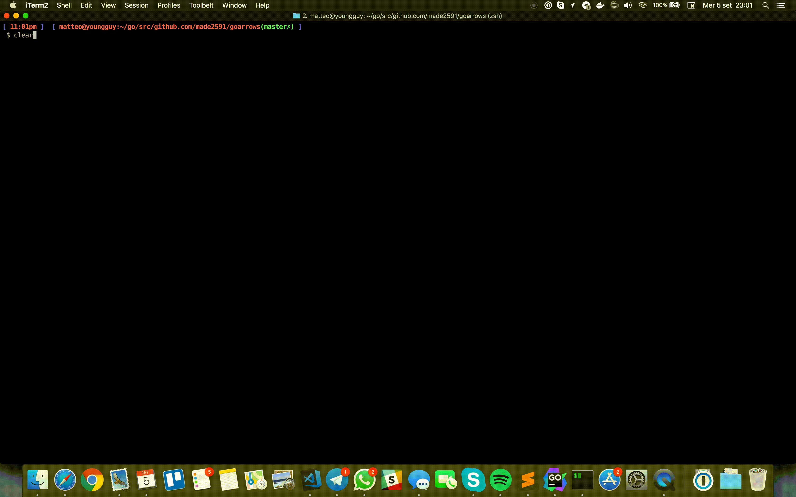

# Go-arrows

Go-arrows is a superminimal puzzle game written in Go. To try the game, from a shell:

```shell
go get github.com/nsf/termbox-go
git clone https://github.com/made2591/goarrows
cd goarrows
go run main.go
```
Instruction will be printed in stdout, with scores (number of) in the end:

<p>
	
</p>

## Dependencies

The only external used is the following:

```shell
go get github.com/nsf/termbox-go
```

Thanks to [nsf](https://github.com/nsf) for [termbox-go](https://github.com/nsf/termbox-go).

## Improvements

- Introduce levels (with combination of arrows)
- Introduce timer for complete moves
- Share result / saving best score
